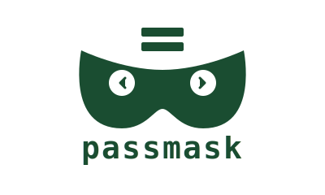

<div align="center">
  
  <p>A Neovim plugin that automatically masks sensitive values in <code>.env</code> files.</p>
</div>

## Video preview


https://github.com/user-attachments/assets/ac624a42-0c30-4377-b3ce-ad23024ea0d7


## What is it?

passmask hides environment variable values with `xxx` overlays while viewing `.env` files. Values are revealed when you enter insert mode, then masked again when you leave.

## Install

**lazy.nvim**
```lua
{
  "realSUDO/passmask",
  ft = "env",
}
```

**packer.nvim**
```lua
use {
  "realSUDO/passmask",
  ft = "env",
}
```

**vim-plug**
```vim
Plug 'realSUDO/passmask'
```

## Usage

Open any `.env` file - masking happens automatically.

**Toggle masking:**
```vim
:PassMaskToggle
```

That's it.
